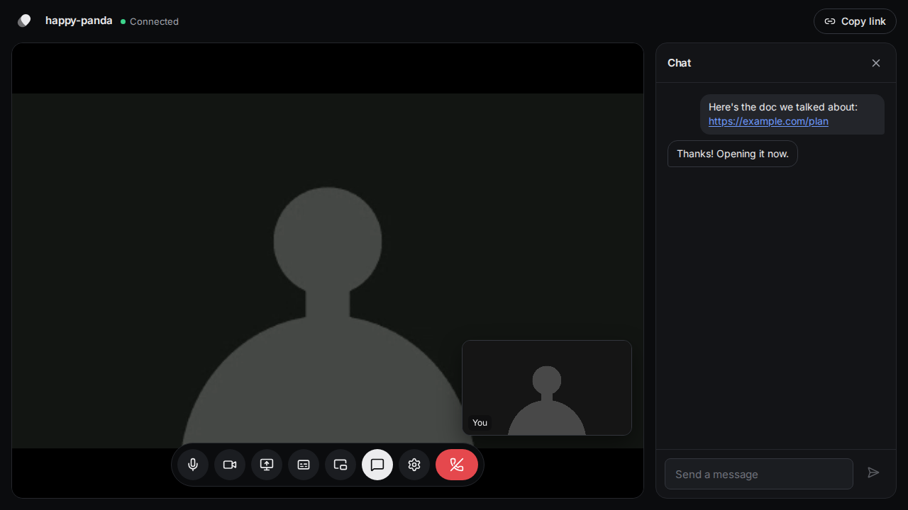

# Zipcall

Free, peer-to-peer video calls in the browser. Pick a name, share the link, and start talking. No
downloads, no accounts.



- **Peer-to-peer:** audio, video, and chat go directly between browsers over WebRTC whenever the
  network allows.
- **Everything a call needs:** screen sharing, chat with clickable links, live captions, picture in
  picture, a choice of camera, microphone, and speaker (remembered between calls), and keyboard
  shortcuts: Ctrl+D (⌘D on a Mac) for the microphone and Ctrl+E (⌘E) for the camera.
- **Resilient:** calls recover from network drops without reloading the page, carry on while the
  server restarts, and pick up a replaced camera or headset automatically. Closing the tab or
  going back mid-call asks first.
- **Private by default:** each call has its own link for two people, and nothing is stored.

## Run it with Docker Compose

You need Docker with Compose v2.24 or newer.

```sh
git clone https://github.com/srinivasdareddy/decentralized-video-chat
cd decentralized-video-chat
docker compose up -d
```

Open <http://localhost:3000>. To call another device you need HTTPS, because browsers only allow
camera access on secure pages. Point a domain at your server, open ports 80 and 443, and start the
bundled [Caddy](https://caddyserver.com) proxy, which gets a certificate automatically:

```sh
DOMAIN=call.example.com docker compose --profile https up -d
```

Behind your own reverse proxy instead? Leave the profile off and forward traffic, including
WebSocket upgrades, to port 3000.

For callers behind strict firewalls, run your own TURN relay with the `turn` profile. Set
`TURN_SECRET` (a long random string), `TURN_URLS` (for example
`turn:call.example.com:3478?transport=udp,turn:call.example.com:3478?transport=tcp`) and, on most
cloud servers, `TURN_EXTERNAL_IP` in `.env`, and open UDP/TCP 3478 and UDP 49152–65535:

```sh
docker compose --profile https --profile turn up -d
```

Going live? [docs/deployment.md](docs/deployment.md) covers firewall ports, a checklist, upgrades
(calls carry on while the app restarts), monitoring, logs, and capacity.

## Configuration

Copy `.env.template` to `.env` and uncomment what you need. Every setting is optional.

| Variable                                  | Default                                     | Purpose                                                                                                    |
| ----------------------------------------- | ------------------------------------------- | ---------------------------------------------------------------------------------------------------------- |
| `TWILIO_ACCOUNT_SID`, `TWILIO_AUTH_TOKEN` | unset                                       | Twilio credentials for TURN relays, which connect calls through strict firewalls. Without them, STUN only. |
| `TURN_URLS`, `TURN_SECRET`                | unset                                       | Your own TURN server (such as coturn with `use-auth-secret`) instead of Twilio.                            |
| `ICE_TRANSPORT_POLICY`                    | `all`                                       | `relay` sends all media through TURN so participants never see each other's IP addresses.                  |
| `STUN_URLS`                               | `stun:stun.l.google.com:19302`              | Comma-separated STUN servers.                                                                              |
| `PUBLIC_URL`                              | taken from each request                     | The site's address, like `https://call.example.com`, for the image in link previews.                       |
| `PORT`                                    | `3000`                                      | Port for the web app and signaling server (not used with Docker Compose).                                  |
| `FORCE_HTTPS`                             | `true` on Heroku, else `false`              | Redirect plain-HTTP requests to HTTPS behind a proxy that sets `X-Forwarded-Proto`.                        |
| `TRUST_PROXY`                             | `0` (`1` on Heroku and with Docker Compose) | How many reverse proxies are in front of the app, so it can find visitors' real IP addresses.              |
| `ALLOWED_ORIGINS`                         | none                                        | Other origins allowed to open signaling connections, if the web app is served elsewhere.                   |
| `MAX_CONNECTIONS_PER_IP`                  | `50`                                        | Simultaneous signaling connections allowed from one public IP address.                                     |
| `LOG_LEVEL`                               | `info`                                      | `debug`, `info`, `warn`, or `error`. `debug` also logs every request.                                      |
| `LOG_FORMAT`                              | `json` in production, else `pretty`         | JSON lines for log collectors, or readable text.                                                           |
| `METRICS_TOKEN`                           | unset (metrics off)                         | Serves Prometheus metrics at `/metrics` to requests with `Authorization: Bearer <token>`.                  |
| `APP_PORT`, `APP_BIND`                    | `3000`, `127.0.0.1`                         | Docker Compose: where the app is published on the host.                                                    |
| `DOMAIN`                                  | `localhost`                                 | Docker Compose `https` profile: the public hostname Caddy serves.                                          |

Most calls connect with STUN alone, but some networks (corporate firewalls, some mobile carriers)
need a TURN relay. The variable names used by earlier versions (`HEROKU_TWILLIO_SID`,
`LOCAL_AUTH_TOKEN`, and so on) still work.

## Development

You need Node.js 22.22 or newer.

```sh
npm install
npm run dev
```

Open <http://localhost:5173>. This runs the Vite dev server with hot reloading and the signaling
server on port 3000, and restarts the server when you change it.

| Command            | What it does                                                        |
| ------------------ | ------------------------------------------------------------------- |
| `npm run dev`      | Start the app for development.                                      |
| `npm run build`    | Build the web client into `build/client`.                           |
| `npm start`        | Serve the built client and run the signaling server.                |
| `npm run check`    | Formatting, lint, typecheck, and unit tests; run before committing. |
| `npm test`         | Unit and integration tests (Vitest).                                |
| `npm run test:e2e` | Browser tests with two fake cameras making real calls (Playwright). |
| `npm run format`   | Format everything with Prettier.                                    |
| `npm run images`   | Redraw the link-preview image and app icons in `public/`.           |

The end-to-end tests need a browser the first time: `npx playwright install chromium` (add
`firefox` to include the Chrome-to-Firefox call test). They build the app and start a server
themselves; set `E2E_BASE_URL` to test one that's already running, such as the Docker container.

CI runs all of this on every push, and again through a real TURN relay and against the Docker
image. Dependabot proposes grouped dependency updates weekly.

## How it works

The Node server serves the pre-built web app and runs a small [Socket.IO](https://socket.io)
signaling service. When two people open the same call link, the server introduces them, hands out
STUN/TURN servers, and relays the WebRTC offer, answer, and network candidates. From then on audio,
video, and chat (over a WebRTC data channel) flow directly between the two browsers, encrypted with
DTLS-SRTP. The server never sees the media.

```text
app/                  Web client: React 19 + React Router 8 (pre-rendered pages, SPA call page)
  call/               The call screen
    call-session.ts   Signaling and the WebRTC connection, including recovery from drops and
                      from losing the server mid-call
    local-media.ts    Camera, microphone, and screen sharing
    peer-messages.ts  Messages sent over the data channel (chat, captions, mute state)
  routes/             Pages: landing, new call, call, unsupported browser
server/               Express 5 + Socket.IO signaling server, run directly by Node (no build step)
shared/protocol.ts    Signaling messages and validation shared by the client and the server
e2e/                  Playwright end-to-end tests
```

## Deploying elsewhere

Any host that runs Node.js 22.22 or newer works: run `npm ci && npm run build`, then `npm start`.
On Heroku the build runs automatically and HTTPS redirects are on by default. See
[Other ways to host it](docs/deployment.md#other-ways-to-host-it) for reverse proxies and
platforms.

## Security and privacy

Report vulnerabilities privately as described in [SECURITY.md](SECURITY.md), which also summarizes
how calls are protected. The privacy page (`/privacy`) explains what data goes where.
[docs/production-readiness.md](docs/production-readiness.md) tracks the production work, and
[CHANGELOG.md](CHANGELOG.md) lists what changed in each version.

## Credits and license

Zipcall was created by [Ian Ramzy](https://ianramzy.com) and is licensed under
[Creative Commons Attribution-NonCommercial 4.0](LICENSE).
